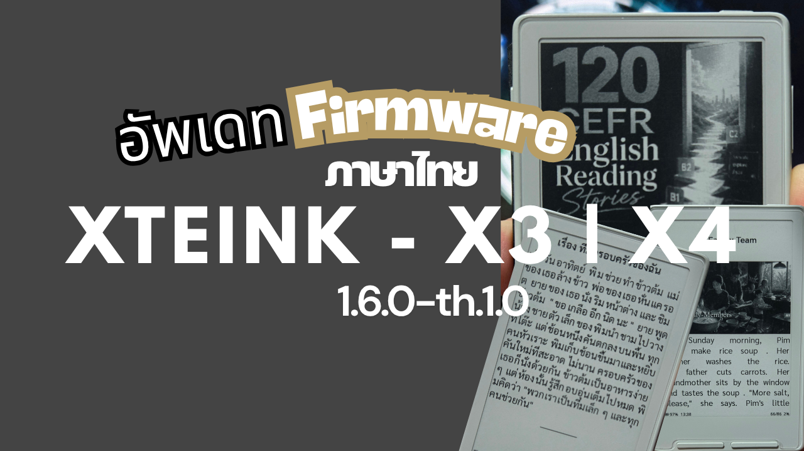
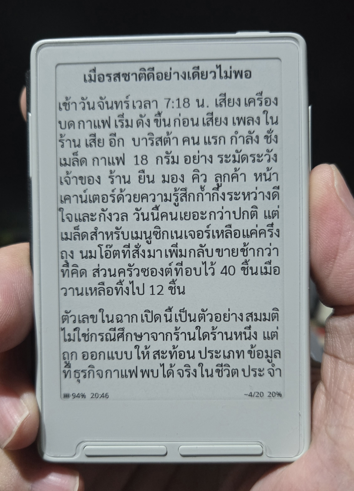
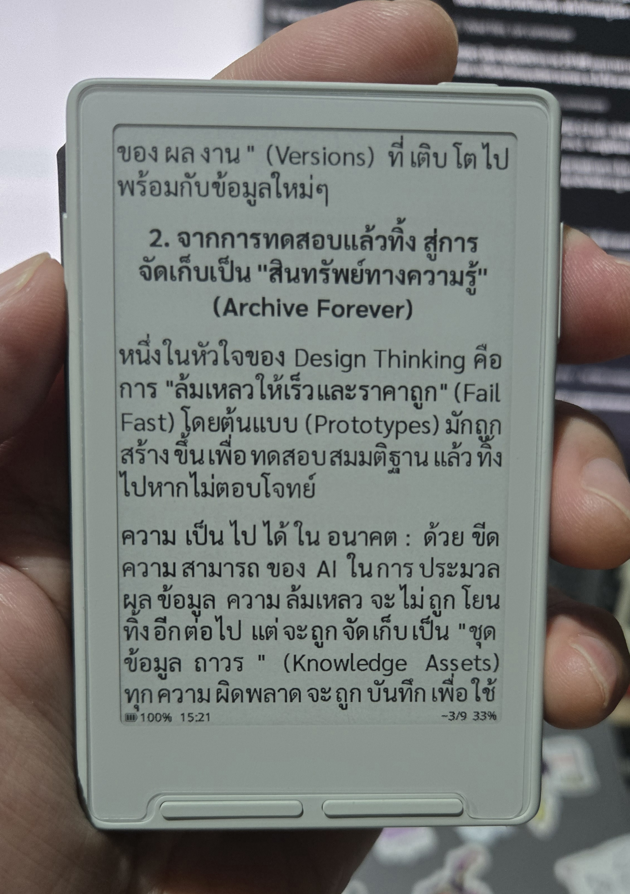

# CrosspointTH v1.6.0-th.1.0

เฟิร์มแวร์อ่านหนังสือภาษาไทยสำหรับ **Xteink X3/X4** ปรับแก้โดย
**JTIAPBN.Ai** เพื่อให้ภาษาไทยแสดงผล ตัดคำ และจัดหน้าได้เหมาะกับจอ e-ink มากขึ้น

> `crosspointTH` เป็นรุ่นชุมชนที่พัฒนาต่อยอดจาก CrossPoint Reader และไม่ใช่รุ่นทางการของ
> CrossPoint Reader

  

## วิดีโอวิธีติดตั้ง

  

  <a href="https://youtu.be/wXqNoefhf3M"><strong>▶ ดูวิดีโอวิธีติดตั้ง crosspointTH บน YouTube</strong></a>

## ดาวน์โหลดรุ่นภาษาไทย

รุ่นปัจจุบัน: **v1.6.0-th.1.0 (Release)**

- [ดาวน์โหลด crosspointTH-firmware.bin](https://github.com/JTIAPBNAI/CrosspointTH/releases/download/v1.6.0-th.1.0/crosspointTH-firmware.bin)
- [ดูรายละเอียดรุ่นและไฟล์ SHA-256](https://github.com/JTIAPBNAI/CrosspointTH/releases/tag/v1.6.0-th.1.0)
- [รายละเอียดแอปและรูปแบบ Flashcards](./docs/APPS.md)
- [บันทึกการเปลี่ยนแปลง v1.6.0-th.1.0](./docs/releases/v1.6.0-th.1.0.md)

รุ่นนี้ผ่านการทดสอบการใช้งานและเผยแพร่เป็นรุ่นปกติแล้ว แต่ยังแนะนำให้สำรองไฟล์สำคัญใน SD card
และเก็บ firmware รุ่นเดิมไว้สำหรับย้อนกลับก่อนอัปเดต

## จุดเด่นของ crosspointTH

- มีฟอนต์ Noto Sans/Serif ที่ครอบคลุม glyph ภาษาไทยในเฟิร์มแวร์
- fallback ไปใช้ฟอนต์ builtin โดยอัตโนมัติเมื่อฟอนต์จาก SD card ไม่มี glyph ภาษาไทย
- ตัดคำไทยด้วยพจนานุกรม โดยไม่แยกพยัญชนะ สระ และวรรณยุกต์ออกจาก cluster เดียวกัน
- จัดตำแหน่งสระบนและวรรณยุกต์ซ้อนหลายชั้น เช่น `อึ่` `อื้อ` `ปึ้` และ `อ่ำ`
- ลดงานซ้ำขณะสร้าง index ของไฟล์ `.txt` และ `.md` ภาษาไทย
- เปิดและทำ index EPUB แบบ incremental, ทำงานส่วนที่เหลือเบื้องหลัง และดึงรูปภาพเมื่อถึงหน้าใช้งาน
  เพื่อลดเวลารอและ peak memory ตอนเปิดหนังสือ
- มีหน้า **Text Settings** แบบรวมพร้อมตัวอย่างสดสำหรับฟอนต์ ขนาด ระยะ และการจัดแนว
- แสดง Markdown แบบมี heading, ตัวหนา, ตัวเอียง, inline code, list, quote, ข้อความลิงก์
  และ pipe table ที่จัดแต่ละแถวเป็นข้อมูลเรียงลงมาให้อ่านง่ายบนจอขนาดเล็ก
- ตารางใน EPUB ใช้ชื่อคอลัมน์จริงจาก `<th>` แทนข้อความ `Tab Row …, Cell …`; ถ้าไฟล์ไม่มี
  หัวตารางจะแสดง `Column N`
- ใช้การจัดแนวย่อหน้าและระยะบรรทัดจาก Reader Settings กับไฟล์ TXT/Markdown
- จำกัดการขยายแบบ justified ไว้ไม่เกิน 1 พิกเซลต่อขอบเขตคำไทย และไม่ยืดภายใน glyph cluster
- มีสถิติการอ่านแบบ lightweight สำหรับ EPUB: จำนวนครั้ง เวลาอ่าน หน้าที่อ่านไปข้างหน้า
  และหนังสือที่อ่านจบ โดยเขียนลง SD เมื่อออกจาก reader แทนการเขียนทุกหน้า
- เพิ่มเมนู **Apps** ที่แยกจาก reader core: นาฬิกาและปฏิทิน พ.ศ., อากาศ, Pomodoro,
  Flashcards แบบอ่าน deck จาก SD ทีละบรรทัด และเกม 2048/Sudoku/Minesweeper/Caro/หมากฮอสไทย
- เพิ่ม Sleep Screen แบบ **ปฏิทิน + สภาพอากาศ** ซึ่งใช้ข้อมูลอากาศล่าสุดจาก cache โดยไม่เปิด Wi-Fi
  และอัปเดตเวลาทุก 5 นาทีบน X3 พร้อมขยายตัวเลข Pomodoro ให้อ่านได้ชัดจากระยะไกลขึ้น

## การอ่านไฟล์ Markdown ขนาดใหญ่

เมื่อเปิดไฟล์ `.md` เครื่องจะแสดงหน้าแรกก่อนและทำ index หน้าที่เหลือต่อแบบทยอยทำงาน กรุณารอให้
สถานะ **Indexing แสดง 100%** ก่อนใช้งานต่อเนื่องหรือเปลี่ยนหน้าอย่างรวดเร็ว ระหว่างทำ index
คำสั่งเปลี่ยนหน้าอาจตอบสนองช้าชั่วคราว โดยเฉพาะช่วงที่มีบรรทัดยาว ตาราง หรือข้อความภาษาไทยจำนวนมาก

เปอร์เซ็นต์คำนวณจากตำแหน่งข้อมูลในไฟล์ ไม่ใช่เวลาที่เหลือ ดังนั้นช่วง 80–90% อาจใช้เวลานานกว่า
ช่วงก่อนหน้าได้ หากตัวเลขยังขยับอยู่ถือว่าเครื่องยังทำงานตามปกติ เมื่อครบ 100% ระบบจะเก็บ index
ไว้และการเปิดครั้งถัดไปจะเร็วขึ้น

แนะนำให้ใช้ [XTEINK EPUB Optimizer](https://xteinkepuboptimizer.whisperingweekends.com/) ก่อนนำหนังสือ
ขนาดใหญ่ลง SD card โดยเครื่องมือรองรับทั้งสองรูปแบบ:

- แปลงไฟล์ `.md` เป็น EPUB พร้อมจัดหัวข้อ ย่อหน้า และตารางให้เหมาะกับอุปกรณ์
- optimize ไฟล์ `.epub` เดิม เพื่อลดขนาด ปรับรูปภาพ และจัดโครงสร้างตารางให้เหมาะกับการอ่านบน XTEINK

การแปลง Markdown เป็น EPUB โดยทั่วไปให้ประสบการณ์เปิดไฟล์และเปลี่ยนหน้าที่ลื่นกว่า Markdown โดยตรง

รายละเอียดการทำงานและกรณีทดสอบอยู่ใน
[เอกสารระบบภาษาไทย](./docs/THAI_SUPPORT.md) และ
[ผลการประเมินฟีเจอร์จาก CrossInk](./docs/CROSSINK_REVIEW.md)

## ภาพตัวอย่าง

  
  
  

## วิธีติดตั้ง

### อัปเดตผ่าน SD card

เหมาะสำหรับเครื่องที่ใช้งาน CrossPoint อยู่แล้ว

1. ดาวน์โหลด `crosspointTH-firmware.bin`
2. ตรวจสอบ SHA-256 ให้ตรงกับค่าที่เผยแพร่
3. เปลี่ยนชื่อไฟล์เป็น `firmware.bin` แล้ววางไว้ที่ root ของ SD card
4. เลือก **Settings → System → SD Card Firmware Update**

### ติดตั้งผ่าน USB

ใช้หน้า web flasher ของ CrossPoint Reader เลือก X3 หรือ X4 ให้ตรงกับเครื่อง จากนั้นเลือก
**Custom .bin** และระบุไฟล์ `crosspointTH-firmware.bin`

> ห้ามตัดไฟ ปิดเครื่อง หรือถอดสายระหว่างเขียนเฟิร์มแวร์ และห้ามเขียน app image นี้ที่ offset
> อื่นนอกจาก `0x10000` หากไม่เข้าใจเรื่อง offset ให้ใช้ SD card updater หรือ web flasher เท่านั้น

## ตั้งค่าภาษาไทย

- เลือก **Settings → System → Language → ไทย**
- เลือกฟอนต์ที่ **Settings → Reader → Text Settings → Font** หากฟอนต์ SD ไม่มีภาษาไทย ระบบจะ fallback
  ไปใช้ Noto builtin
- ปรับ **Text Settings → Layout → Line Spacing** เป็น Tight / Normal / Wide
- ปรับ **Text Settings → Alignment** เป็น Justified / Left / Center / Right

ไม่มีการเพิ่มระยะห่าง “ระหว่างตัวอักษรไทย” แบบอิสระ เพราะสระและวรรณยุกต์ต้องยึดกับพยัญชนะใน
cluster เดียวกัน การยืดระหว่างองค์ประกอบเหล่านี้ทำให้ภาษาไทยผิดรูปได้

## ความปลอดภัยและการย้อนกลับ

- รุ่นนี้คง partition table, bootloader, HAL, power manager, display driver และ OTA ทาง Wi-Fi ตามฐาน
  upstream; SD updater เพิ่มการอ่าน flash กลับมาเทียบทุก block ก่อนสลับ boot slot
- เฟิร์มแวร์ release ผ่าน safety gate, unit tests, static checks และการตรวจชนิด/ขนาด image
- ก่อนติดตั้งควรเก็บ firmware ทางการไว้หนึ่งชุด และสำรองไฟล์สำคัญใน SD card
- สามารถย้อนกลับด้วยไฟล์ `firmware.bin` จาก
  [CrossPoint Reader Releases](https://github.com/crosspoint-reader/crosspoint-reader/releases)
  ผ่าน SD card updater หรือ USB custom firmware แบบเดียวกัน
- หาก firmware ใหม่เริ่มถึง `setup()` แต่เปิด UI ไม่ได้ และ slot `ota_0` ยังเป็น firmware เดิมที่ใช้ได้:
  กด **Back + Up ค้างระหว่างกด Reset** เพื่อสลับกลับไป slot นั้น หาก image เสียจนเริ่ม `setup()` ไม่ได้
  หรือ `ota_0` ถูกเขียนทับแล้ว ต้องใช้ USB recovery

ไม่มีเฟิร์มแวร์ใดรับประกันความเสี่ยงจากไฟดับ สายหลุด เลือกรุ่นอุปกรณ์ผิด หรือฮาร์ดแวร์เสียหายเดิมได้
ผู้ใช้ควรอัปเดตอย่างระมัดระวังและรายงานรุ่นเครื่อง ขั้นตอน และ log เมื่อพบปัญหา

## เอกสาร

- [คู่มือภาษาไทยฉบับย่อ](./README-TH.md)
- [รายละเอียดระบบภาษาไทยและ release safety checklist](./docs/THAI_SUPPORT.md)
- [รายการเปลี่ยนแปลงของ crosspointTH](./CHANGELOG-crosspointTH.md)
- [เครดิตและที่มาของโครงการ](./ATTRIBUTION.md)
- [สัญญาอนุญาตของฟอนต์และข้อมูล third-party](./THIRD_PARTY_NOTICES.md)

## การพัฒนาและเครดิต

ผู้ปรับแก้ภาษาไทย: **JTIAPBN.Ai**

โครงการนี้พัฒนาต่อยอดจาก
[crosspoint-reader/crosspoint-reader](https://github.com/crosspoint-reader/crosspoint-reader) และเผยแพร่
ภายใต้ GNU GPL v3 ตามไฟล์ [LICENSE](./LICENSE) ลิขสิทธิ์และเครดิตของ upstream และ third-party
ยังคงเป็นของเจ้าของเดิมตาม [ATTRIBUTION.md](./ATTRIBUTION.md) และ
[THIRD_PARTY_NOTICES.md](./THIRD_PARTY_NOTICES.md)
